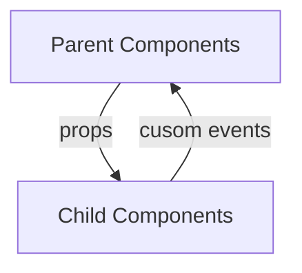

A note taking from Fullstack Vue.<br>

Covers: Part I: Basics
- II - Single-file components

FYR: [Vue.js 2.X Style Guide](https://vuejs.org/v2/style-guide/)

# Part I: Basics
## II - Single-file components
### Introduction
In this chapter, we'll be diving in deeper into building components with Vue.<br>
To create an app interface manages events within a weekly calendar.

### Setting up development environment
- Node.js
- npm

Check node is installed:
```
$ node -v
```

Check npm is installed:
```
$ npm -v
```

### Getting started and Preview the app
Change directory to the project folder:
```
$ cd calendar_app
```

Use npm to install all the dependencies:
```
$ npm install
```

Start the npm server:
```
$ npm run serve

// default url: http://localhost:8080
```

Project layout:
```
- README.md

- babel.config.js
Babel is a JavaScript transpiler that transpiles ES6 syntax to older ES5 syntax.
The .babel.config.js file can be used to configure the Babel presets and plugins.

- node_modules/
refers to all the different JavaScript libraries that have been installed in our application.

- package.json
lists all the locally installed npm packages.
The scripts portion dictates the npm commands that can be run in our application.

- public/
hosts the bulma and font-awesome libraries.
contains the index.html file which represents the root markup page of our application.

- src/
contains the JavaScript files that we'll be working directly with.
```

The Vue CLI scaffolds a standard Webpack configuration that's able to be used by most Vue applications.

FYR: [vue-cli 3で作成したVue.jsアプリをサブディレクトリで展開](https://labor.ewigleere.net/2019/02/06/vue-cli3-vue-app-deploy-subdirectory/)

Import App from **./app/App.vue** to load the application from a starting point:
```javascript
# /app/App.vue

import Vue from 'vue';
import App from './app/App.vue';
new Vue({
    render: h => h(App)
}).$mount('#app');
```
Use `$mount('#app')` instead of an `el option` to mount the Vue application.<br>
`$mount()` provides additional flexibility by allowing us to call it when we want, even after the Vue instance has already been instantiated.

Vue's `render function` is an alternative to templates.<br>
Since our application is runtime only build, we can't declare **\<App\>\<\/App\>** in a template option like we did in the first chapter.

### Single-File Components
Vue.component:
```javascript
const submissionComponent = {
    template: `
                <div>
                    <p>Component Template</p>
                </div>`,
}
new Vue({
    el: '#app',
    components: {
        'submission-component': submissionComponent
    }
})
```
The above does a good job for small to medium sized projects. <br>
However, as an application grows, global components create limitations.

As a result, Vue provides the option to use `single-file components` to reduce this disorganization.

- `<template>` which contains the component's markup in plain HTML
- `<script>` which exports the component object constructor that consists of all the JS logic within that component
- `<style>` which contains all the component styles

Single-file components in Vue are made possible due to build tools like Webpack.

Example: Vue single-file component
```vue
<template>
    <h2>{{ getGreeting }}</h2>
    <p>This is the Hello World component.</p>
</template>

<script>
export default {
    name: 'MyComponent',
    data () {
        return {
            reversedGreeting: '!dlrow olleH'
        }
    },
    computed: {
        getGreeting() {
            return this.reversedGreeting.split("").reverse().join("");
        }
    }
}
</script>

<style lang="scss" scoped>
h2 {
    width: 100%;
    text-align: center;
}
</style>
```

The `<style>` tag specifies **lang="scss"** which dictates the use of the SCSS preprocessor.
`scoped` dictates these styles will be applied to this and only this component.

### Breaking the app into components
- App: Parent container
- CalendarWeek: Displays a row of calendar days
  - CalendarDay: Displays a list of day events
  - CalendarEvent: Displays a given event
- CalendarEntry: Displays a new event form

### Components Communication
#### Parent-Child Components
Child components should never reference data directly from parent components.<br>
For a child component to access data from a parent, data has to flow from the parent down to the child with the help of **props**.<br>
Child components will never be able to mutate parent state directly.

#### Child-Parent Components
Children components can only directly communicate with a parent through **custom events**.

Vue's custom events
- `$emit(nameOfEvent)` triggering events within a particular component
- `$on(nameOfEvent)` listening for that event in another component



#### Sibling Components
Managing data between sibling components in Vue:
- Using a global event bus<br>
  A global event bus builds on top of using Vue's simple custom events by making events global to the entire application.
- Using a simple, shared store object (for simple state management)
- Using the state management library Vuex<br>
  Vuex builds upon having a simple state object by introducing explicitly defined getters, mutations, and actions.<br>
  The Vue style guide suggests Vuex as the preferred method for global state management in large scale applications.

### Simple State Management
Simple state management can be performed by creating a store pattern that involves sharing a data store between components.

Example:
```javascript
# store.js
export const store = {
    state: {
        numbers: [1, 2, 3]
    },
    pushNewNumber(newNumberString) {
        this.state.numbers.push(Number(newNumberString));
    }
}
```
---
```vue
# NumberDisplay.vue

<template>
    <div>
        <h2>{{ storeState.numbers }}</h2>
    </div>
</template>

<script>
import { store } from './store.js';
export default {
    name: 'NumberDisplay',
    data () {
        return {
            storeState: store.state
        }
    }
}
</script>
```
---
```vue
# NumberSubmit.vue

<template>
    <div>
        <input v-model="newNumber" type="number" />
        <button @click="pushNewNumber(newNumber)">Add new number</button>
    </div>
</template>

<script>
import { store } from './store.js';
export default {
    name: 'NumberSubmit',
    data () {
        return {
            newNumber: 0
        }
    },
    methods: {
        pushNewNumber(newNumber) {
        store.pushNewNumber(newNumber);
        }
    }
}
</script>
```

Whenever the data within store state is manipulated, the relevant DOM automatically updates.<br>
Components are not allowed to change state directly. Instead they need to dispatch events for the store to listen and invoke a mutation within.

### Steps to building Vue apps from scratch
Generic approach for developing an app from scratch:

1. Build a static version of the app
2. Break the app into components
3. Hard-code initial states with parent-child data flow
4. Create state mutations (and accompanying component dispatchers)

#### Step 1: A static version of the app
```vue
# App.vue

<template>
<div id="app">
    <div id="calendar-week" class="container">
        <!-- Markup for calendar week -->
    </div>
    <div id="calendar-entry">
        <!-- Markup for calendar entry -->
    </div>
</div>
</template>

<script>
export default {
    name: 'App'
}
</script>

<style lang="scss">
html, body {
    height: 100%;
}
#app {
    <!-- SCSS for app -->
}
#calendar-week {
    <!-- SCSS for calendar week -->
}
#calendar-entry {
    <!-- SCSS for calendar entry -->
}
</style>
```

#### Step 2: Breaking the app into components
- component names should generally be multi-word
- filenames for single-file components should either be kebab-case (calendar-entry.vue) or PascalCase (CalendarEntry.vue)

Directory structure:
```
- calendar app/
  - public/
    - plugin 1/
    - plugin 2/
    - index.html
  - src/
    - app/
      - components/
        - CalendarEntry.vue
        - CalendarWeek.vue
      - App.vue
      - seed.js
    - main.js
  - babel.config.js
  - package-lock.json
  - package.json
```

Components:
```vue
# CalendarWeek.vue

<template>
    <div id="calendar-week" class="container">
        <!-- Markup for calendar week -->
    </div>
</template>

<script>
export default {
    name: 'CalendarWeek'
}
</script>

<style lang="scss" scoped>
#calendar-week {
    <!-- SCSS for calendar week -->
}
</style>
```
---
```vue
# CalendarEntry.vue

<template>
    <div id="calendar-entry">
        <!-- Markup for calendar entry -->
    </div>
</template>

<script>
export default {
    name: 'CalendarEntry'
}
</script>

<style lang="scss" scoped>
#calendar-entry {
    <!-- SCSS for calendar entry -->
}
</style>
```
---
```vue
# App.vue

<template>
<div id="app">
    <CalendarWeek />
    <CalendarEntry />
</div>
</template>

<script>
import CalendarWeek from './components/CalendarWeek.vue';
import CalendarEntry from './components/CalendarEntry.vue';
export default {
    name: 'App',
    components: {
        CalendarWeek,
        CalendarEntry
    }
}
</script>

<style lang="scss">
html, body {
height: 100%;
}
</style>
<style lang="scss" scoped>
#app {
    <!-- SCSS for APP -->
}
</style>
```

#### Step 3: Hardcode Initial States

Manage state and seeds in **src/app/store.js**:
```javascript
# store.js

import { seedData } from './seed.js';
export const store = {
    state: {
        seedData
    }
}
```

ES6 property value shorthand `state: { seedData }` is equivalent to `state: { seedData: seedData }`.

```vue
# CalendarWeek.vue

<template>
    <div id="calendar-week" class="container">
        <div class="columns is-mobile">
            <CalendarDay v-for="day in sharedState.seedData" :key="day.id" :day="day" />
        </div>
    </div>
</template>

<script>
import { store } from '../store.js';
import CalendarDay from './CalendarDay.vue';

export default {
    name: 'CalendarWeek',
    data () {
        return {
            sharedState: store.state
        }
    },
    components: {
        CalendarDay
    }
}
</script>

<style lang="scss" scoped>
#calendar-week {
    <!-- SCSS for calendar week -->
}
</style>
```
---
```vue
# CalendarDay.vue

<template>
    <div class="day column">
        <div class="day-banner has-text-centered">{{ day.abbvTitle }}</div>
        <div class="day-details">
            <div class="day-number">{{ day.id }}</div>
            <CalendarEvent 
                v-for="(event, index) in day.events" 
                :key="index" :event="event" :day="day"/>
        </div>
    </div>
</template>

<script>
import CalendarEvent from './CalendarEvent.vue';

export default {
    name: 'CalendarDay',
    props: ['day'],
    components: {
        CalendarEvent
    }
}
</script>

<style lang="scss" scoped>
<!-- SCSS for calendar day -->
</style>
```
---
```vue
# CalendarEvent.vue

<template>
    <!-- Markup for calendar event -->
</template>

<script>
export default {
    name: 'CalendarEvent',
    props: ['event', 'day'],
    computed: {
        getEventBackgroundColor() {
            const colors = ['#FF9999', '#85D6FF', '#99FF99'];
            let randomColor = colors[Math.floor(Math.random() * colors.length)];
            return `background-color: ${randomColor}`;
        }
    }
}
</script>

<style lang="scss" scoped>
<!-- SCSS for calendar day -->
</style>
```

#### Step 4: Create state mutations (and corresponding component actions)
Application interactions:
1. Get / Set the active day<br> 
   When user clicks a day within the calendar week, CalendarEntry component should reference the day selected.
2. User can submit a new event to a certain day.
3. User can edit and update the events. 
4. user can remove the events.

##### 1. Get / Set the active day
```javascript
# seed.js
{
    id: 1,
    abbvTitle: 'Mon',
    fullTitle: 'Monday',
    events: [
        { details: 'Get Groceries', edit: false },
        { details: 'Carpool', edit: false }
    ],
    // Primary indicator for active day
    active: true
},
```
---
```javascript
# store.js

import { seedData } from './seed.js';
export const store = {
    state: {
        seedData
    },
    getActiveDay () {
        return this.state.seedData.find((day) => day.active);
    },
    setActiveDay (dayId) {
        this.state.seedData.map((dayObj) => {
            dayObj.id === dayId ? dayObj.active = true : dayObj.active = false;
        });
    }
}
```
---
```vue
# CalendarDay.vue

<template>
    <div class="day column" @click="setActiveDay(day.id)">
        <div class="day-banner has-text-centered">{{ day.abbvTitle }}</div>
        <div class="day-details">
            <div class="day-number">{{ day.id }}</div>
            <CalendarEvent 
                v-for="(event, index) in day.events" 
                :key="index" :event="event" :day="day"/>
        </div>
    </div>
</template>

<script>
import { store } from '../store.js';
import CalendarEvent from './CalendarEvent.vue';

export default {
    name: 'CalendarDay',
    props: ['day'],
    methods: {
        setActiveDay (dayId) {
            store.setActiveDay(dayId);
        }
    },
    components: {
        CalendarEvent
    }
}
</script>

<style lang="scss" scoped>
<!-- SCSS for calendar day -->
</style>
```
---
```vue
# CalendarEntry.vue

<template>
    <div id="calendar-entry">
        <div class="calendar-entry-note">
            <input type="text" placeholder="New Event" />
            <p class="calendar-entry-day">
                Day of event: <span class="bold">{{ titleOfActiveDay }}</span>
            </p>
            <a class="button is-primary is-small is-outlined">Submit</a>
        </div>
    </div>
</template>

<script>
import { store } from '../store.js';
export default {
    name: 'CalendarEntry',
    computed: {
        titleOfActiveDay () {
            return store.getActiveDay().fullTitle;
        }
    },
}
</script>
```

##### 2. Submit a new event
```javascript
# store.js

import { seedData } from './seed.js';
export const store = {
    state: {
        seedData
    },
    getActiveDay () {
        return this.state.seedData.find((day) => day.active);
    },
    setActiveDay (dayId) {
        this.state.seedData.map((dayObj) => {
            dayObj.id === dayId ? dayObj.active = true : dayObj.active = false;
        });
    },
    submitEvent (eventDetails) {
        const activeDay = this.getActiveDay();
        activeDay.events.push({ "details": eventDetails, "edit": false });
    }
}
```

Add functionalities:
- Bind data value by `v-model directive`
- Use `error property` to prevent state mutation
- Show error message by `v-if directive`

To capture the input value, use the `v-model directive` to create two-way data binding between the form input and a data property in the component.<br>
`v-model directly` binds user input with a Vue object's data model.

`error property`:
- Displays an error message if the user clicks submit without typing anything in the input
- Prevents the action from calling the state mutation

The `v-if directive` takes a data property as an expression and renders a particular code-block based on the truthiness of that data property.

```vue
# CalendarEntry.vue

<template>
    <div id="calendar-entry">
        <div class="calendar-entry-note">
            <input type="text" placeholder="New Event" v-model="inputEntry" required />
            <p class="calendar-entry-day">
                Day of event: <span class="bold">{{ titleOfActiveDay }}</span>
            </p>
            <a class="button is-primary is-small is-outlined" 
                @click="submitEvent(inputEntry)">Submit</a>
        </div>
        <p style="color: red; font-size: 13px" v-if="error">
            You must type something first!
        </p>
    </div>
</template>

<script>
import { store } from '../store.js';
export default {
    name: 'CalendarEntry',
    data () {
        return {
            inputEntry: '',
            // error property
            error: false
        }
    },
    computed: {
        titleOfActiveDay () {
            return store.getActiveDay().fullTitle;
        }
    },
    methods: {
        submitEvent (eventDetails) {
            if (eventDetails === '') return this.error = true;

            store.submitEvent(eventDetails);
            this.inputEntry = '';
            this.error = false;
        }
    }
}
</script>
```

##### 3. Update the events
Use `v-if directive` to toggle between the interfaces:
- Display mode
- Edit mode

```vue
# CalendarEvent.vue

<template>
    <div class="day-event" :style="getEventBackgroundColor">
        <div v-if="!event.edit">
            <span class="has-text-centered details">{{ event.details }}</span>
            <div class="has-text-centered icons">
                <i class="fa fa-pencil-square edit-icon"></i>
                <i class="fa fa-trash-o delete-icon"></i>
            </div>
        </div>
        <div v-if="event.edit">
            <input type="text" :placeholder="event.details"/>
            <div class="has-text-centered icons">
                <i class="fa fa-check"></i>
            </div>
        </div>
    </div>
</template>
```

Get the event to edit:
```javascript
# store.js

import { seedData } from './seed.js';
export const store = {
    state: {
        seedData
    },
    getActiveDay () {
        return this.state.seedData.find((day) => day.active);
    },
    setActiveDay (dayId) {
        this.state.seedData.map((dayObj) => {
            dayObj.id === dayId ? dayObj.active = true : dayObj.active = false;
        });
    },
    submitEvent (eventDetails) {
        const activeDay = this.getActiveDay();
        activeDay.events.push({ "details": eventDetails, "edit": false });
    },
    editEvent (dayId, eventDetails) {
        const dayObj = this.state.seedData.find(
            day => day.id == dayId
        );
        const eventObj = dayObj.events.find(
            event => event.details === eventDetails
        );

        eventObj.edit = true;
    }
}
```
---
```vue
# CalendarEvent.vue

<template>
    <div class="day-event" :style="getEventBackgroundColor">
        <div v-if="!event.edit">
            <span class="has-text-centered details">{{ event.details }}</span>
            <div class="has-text-centered icons">
                <i class="fa fa-pencil-square edit-icon" 
                    @click="editEvent(day.id, event.details)"></i>
                <i class="fa fa-trash-o delete-icon"></i>
            </div>
        </div>
        <div v-if="event.edit">
            <input type="text" :placeholder="event.details"/>
            <div class="has-text-centered icons">
                <i class="fa fa-check"></i>
            </div>
        </div>
    </div>
</template>

<script>
import { store } from '../store.js';

export default {
    name: 'CalendarEvent',
    props: ['event', 'day'],
    computed: {
        getEventBackgroundColor() {
            const colors = ['#FF9999', '#85D6FF', '#99FF99'];
            let randomColor = colors[Math.floor(Math.random() * colors.length)];
            return `background-color: ${randomColor}`;
        }
    },
    methods: {
        editEvent (dayId, eventDetails) {
            store.editEvent(dayId, eventDetails);
        }
    }
}
</script>
```

Next, let's only allow the editing of one event at a time.<br>
Introduce a `resetEditOfAllEvents()` helper method in our store that sets all events to the non-edit state prior to toggling the targeted event.

```javascript
# store.js

import { seedData } from './seed.js';
export const store = {
    state: {
        seedData
    },
    getActiveDay () {
        return this.state.seedData.find((day) => day.active);
    },
    setActiveDay (dayId) {
        this.state.seedData.map((dayObj) => {
            dayObj.id === dayId ? dayObj.active = true : dayObj.active = false;
        });
    },
    submitEvent (eventDetails) {
        const activeDay = this.getActiveDay();
        activeDay.events.push({ "details": eventDetails, "edit": false });
    },
    editEvent (dayId, eventDetails) {
        // only allows editing a single event at a time
        this.resetEditOfAllEvents();

        const dayObj = this.state.seedData.find(
            day => day.id == dayId
        );
        const eventObj = dayObj.events.find(
            event => event.details === eventDetails
        );

        eventObj.edit = true;
    },
    resetEditOfAllEvents () {
        this.state.seedData.map((dayObj) => {
            dayObj.events.map((event) => {
                event.edit = false;
            });
        });
    }
}
```

Update event detail with user input.

```vue
# CalendarEvent.vue

<template>
    <div class="day-event" :style="getEventBackgroundColor">
        <div v-if="!event.edit">
            <span class="has-text-centered details">{{ event.details }}</span>
            <div class="has-text-centered icons">
                <i class="fa fa-pencil-square edit-icon" 
                    @click="editEvent(day.id, event.details)"></i>
                <i class="fa fa-trash-o delete-icon"></i>
            </div>
        </div>
        <div v-if="event.edit">
            <input type="text" :placeholder="event.details" v-model="newEventDetails"/>
            <div class="has-text-centered icons">
                <i class="fa fa-check" 
                    @click="updateEvent(day.id, event.details, newEventDetails)"></i>
            </div>
        </div>
    </div>
</template>

<script>
import { store } from '../store.js';

export default {
    name: 'CalendarEvent',
    props: ['event', 'day'],
    computed: {
        getEventBackgroundColor() {
            const colors = ['#FF9999', '#85D6FF', '#99FF99'];
            let randomColor = colors[Math.floor(Math.random() * colors.length)];
            return `background-color: ${randomColor}`;
        }
    },
    data () {
        return {
            newEventDetails: ''
        }
    },
    methods: {
        editEvent (dayId, eventDetails) {
            store.editEvent(dayId, eventDetails);
        },
        updateEvent (dayId, originalEventDetails, updatedEventDetails) {
            if (updatedEventDetails === '') updatedEventDetails = originalEventDetails;
            store.updateEvent(dayId, originalEventDetails, updatedEventDetails);
            this.newEventDetails = '';
        },
    }
}
</script>
```
---
```javascript
# store.js

import { seedData } from './seed.js';
export const store = {
    state: {
        seedData
    },
    getActiveDay () {
        return this.state.seedData.find((day) => day.active);
    },
    setActiveDay (dayId) {
        this.state.seedData.map((dayObj) => {
            dayObj.id === dayId ? dayObj.active = true : dayObj.active = false;
        });
    },
    submitEvent (eventDetails) {
        const activeDay = this.getActiveDay();
        activeDay.events.push({ "details": eventDetails, "edit": false });
    },
    editEvent (dayId, eventDetails) {
        this.resetEditOfAllEvents();

        const dayObj = this.state.seedData.find(
            day => day.id == dayId
        );
        const eventObj = dayObj.events.find(
            event => event.details === eventDetails
        );

        eventObj.edit = true;
    },
    resetEditOfAllEvents () {
        this.state.seedData.map((dayObj) => {
            dayObj.events.map((event) => {
                event.edit = false;
            });
        });
    },
    updateEvent (dayId, originalEventDetails, newEventDetails) {
        const dayObj = this.state.seedData.find(
            day => day.id === dayId
        );
        const eventObj = dayObj.events.find(
            event => event.details === originalEventDetails
        );
        
        eventObj.details = newEventDetails;
        eventObj.edit = false;
    },
}
```

In both `editEvent()` and `updateEvent()`, same format is followed to obtain the event object.<br>
Extract the logic to `getEventObj()` method.

```javascript
# store.js

// ...omit

editEvent (dayId, eventDetails) {
    this.resetEditOfAllEvents();
    const eventObj = this.getEventObj(dayId, eventDetails);
    eventObj.edit = true;
},
updateEvent (dayId, originalEventDetails, newEventDetails) {
    const eventObj = this.getEventObj(dayId, originalEventDetails);
    eventObj.details = newEventDetails;
    eventObj.edit = false;
},
getEventObj (dayId, eventDetails) {
    const dayObj = this.state.seedData.find(
        day => day.id === dayId
    );
    return dayObj.events.find(
        event => event.details === eventDetails
    );
},

// ...omit
```

##### 4. Remove the events
Dispatch the `deleteEvent()` method to delete icons.

```vue
# CalendarEvent.vue

<template>
    <div class="day-event" :style="getEventBackgroundColor">
        <div v-if="!event.edit">
            <span class="has-text-centered details">{{ event.details }}</span>
            <div class="has-text-centered icons">
                <i class="fa fa-pencil-square edit-icon" 
                    @click="editEvent(day.id, event.details)"></i>
                <i class="fa fa-trash-o delete-icon" 
                    @click="deleteEvent(day.id, event.details)"></i>
            </div>
        </div>
        <div v-if="event.edit">
            <input type="text" :placeholder="event.details" v-model="newEventDetails"/>
            <div class="has-text-centered icons">
                <i class="fa fa-check" 
                    @click="updateEvent(day.id, event.details, newEventDetails)"></i>
            </div>
        </div>
    </div>
</template>

<script>
export default {
    name: 'CalendarEvent',
    // ...,
    methods: {
    // ...,
        deleteEvent (dayId, eventDetails) {
            store.deleteEvent(dayId, eventDetails);
        }
    }
}
</script>
```

Create `deleteEvent()` in the **store.js** file.

```javascript
export const store = {
    // ...
    deleteEvent (dayId, eventDetails) {
        const dayObj = this.state.seedData.find(
            day => day.id === dayId
        );
        const eventIndexToRemove = dayObj.events.findIndex(
            event => event.details === eventDetails
        );
        dayObj.events.splice(eventIndexToRemove, 1);
    },
    // ...
}
```
