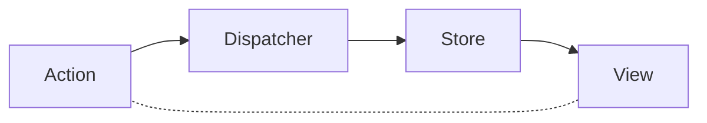

A note taking from Fullstack Vue.<br>

Covers: Part II: Vuex and Routing
- IV - Introduction to Vuex

## IV - Introduction to Vuex
### What is Flux?
Flux is a design pattern created by Facebook. <br>
The Flux pattern is made up of four parts, organized as a **one-way data pipeline**:



1. The view dispatches actions that describe what happened. 
2. The store receives these actions and determines what state changes should occur. 
3. After the state updates, the new state is pushed to the view.

### Vuex
The most-widely used state management library within Vue community.<br>
Vuex was created by the Vue team and built solely for use with Vue.

Vuex's key ideas:
- All data is in a single data structure called the `state` held in the `store`
- App reads the state from this store
- The state is never mutated directly outside the store
- The views dispatch actions that describe what happened
- The actions commit to mutations
- Mutations directly mutate/change store state
- When the state is mutated, relevant components/views are re-rendered

### Refactoring the note-taking app
- State can never be mutated directly and can only be modified by calling mutations. 
- Actions are often responsible in calling mutations and are themselves dispatched within components. 
- A Vuex store also allows us to define getters, methods that involve receiving computed state data.

Pieces that make up a Vuex store:
- state
- mutations
- actions
- getters

#### State
Application level data is the data that needs to be shared between components which is the state.

Wire `notes` and `timestamps` up to the state:
```javascript
# main.js

const state = {
    notes: [],
    timestamps: []
}
```

#### Mutations
Mutation means a function that's responsible in mutating store state.<br>

Mutations in apps:
- Push a new note to the state notes array
- Push a new timestamp to the state timestamps array

In Vuex, mutations need to be explicitly defined.<br>
A mutation consists of a string type (often declared in capital letters) and a handler.

mutation function:
- always have access to `state` as the first argument
- may or may not pass a `payload` (optional argument)
- mutations have to be synchronous (actions are responsible for asynchronous tasks)

```javascript
# main.js

const state = {
    notes: [],
    timestamps: []
}

const mutations = {
    ADD_NOTE (state, payload) {
        let newNote = payload;
        state.notes.push(newNote);
    },
    ADD_TIMESTAMP (state, payload) {
        let newTimeStamp = payload;
        state.timestamps.push(newTimeStamp);
    }
}
```

### Actions
Actions are functions that exist to call mutations and can perform asynchronous calls/logic handling before committing to mutations.

Actions automatically receive `context object` as the first argument to access:
- state with `context.state`
- getters with `context.getters`
- call/commit to mutations with `context.commit`<br>
  using `context.commit` to call the mutations to update the actions object.

```javascript
# main.js

const state = {
    // ...
}

const mutations = {
    // ...
}

const actions = {
    addNote (context, payload) {
        context.commit('ADD_NOTE', payload);
    },
    addTimestamp (context, payload) {
        context.commit('ADD_TIMESTAMP', payload);
    }
}
```

### Getters
Getters are used to derive computed information from store state.

```javascript
# main.js

const state = {
    // ...
}

const mutations = {
    // ...
}

const actions = {
    // ...
}

const getters = {
    // receive state as first argument
    getNotes (state) {
        return state.notes;
    },
    getTimestamps (state) {
        return state.timestamps;
    },
    getNoteCount (state) {
        return state.notes.length;
    }
}
```
---
```javascript
// use ES6 arrow functions to simplify getters object

const getters = {
    getNotes: state => state.notes,
    getTimestamps: state => state.timestamps,
    getNoteCount: state => state.notes.length
}
```

#### Store
The Vuex library provides a declaration for creating stores `Vuex.Store({})`.

```javascript
# main.js

const store = new Vuex.Store({
    state,
    mutations,
    actions,
    getters
})
```
---
```javascript
// use ES6 arrow functions to simplify store object

const store = new Vuex.Store({
    state: state,
    mutations: mutations,
    actions: actions,
    getters: getters
})
```

Pass store object to the application's Vue instance to have it accessible within all components:
```javascript
# main.js

new Vue({
    el: '#app',
    store,
    components: {
        'input-component': inputComponent
    }
})
```

### Building the components
#### input-component
```javascript
# main.js

const inputComponent = {
    template: `<input
        placeholder='Enter a note'
        v-model="input"
        @keyup.enter="monitorEnterKey"
        class="input is-small" type="text" />`,
    data () {
        return {
            input: '',
        }
    },
    methods: {
        monitorEnterKey () {
            this.$store.dispatch('addNote', this.input);
            this.$store.dispatch('addTimestamp', new Date().toLocaleString());
            this.input = '';
        }
    }
}
```

#### note-count-component
```javascript
# main.js

const inputComponent = {
    template: `<div class="note-count">
        Note count: <strong>{{ noteCount }}</strong>
        </div>`,
    computed: {
        noteCount() {
            return this.$store.getters.getNoteCount;
        }
    }
}
```

#### Root Instance
```javascript
# main.js

new Vue({
    el: '#app',
    store,
    computed: {
        notes() {
            return this.$store.getters.getNotes;
        },
        timestamps() {
            return this.$store.getters.getTimestamps;
        }
    },
    components: {
        'input-component': inputComponent,
        'note-count-component': noteCountComponent
    }
})
```
---
```html
# index.html

<!-- omit -->
    <div class="columns">
        <div class="column has-text-centered">
            <strong>Notes</strong>
            <div v-for="note in notes" class="notes">
                {{ note }}
            </div>
        </div>
        <div class="column has-text-centered">
            <strong>Timestamp</strong>
            <div v-for="timestamp in timestamps" class="timestamps">
                {{ timestamp }}
            </div>
        </div>
    </div>
<!-- omit -->
```

### Vuex and Vue devtools
Vue's official devtools provide `Time-travel` debugging allowing us to track and replay changes to the state with each and every mutation.


Debugging in this manner provides an extra layer towards inspecting the various parts of a Vuex store.

FYR:
- [入門者必読、vue.jsの状態管理Vuexがわかる](https://reffect.co.jp/vue/understaind-vue-basic)
- [Vue.jsで開発するときはvue-devtoolsもね](https://beyondjapan.com/blog/2017/06/vue-devtools/)
