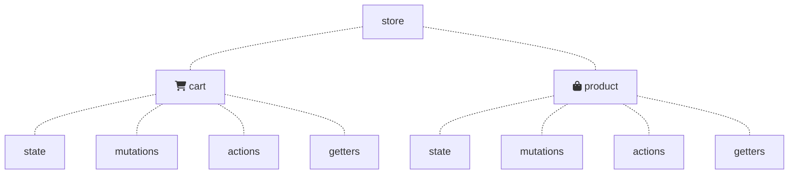

A note taking from Fullstack Vue.<br>

Covers: Part II: Vuex and Routing
- V - Vuex and Servers

## V - Vuex and Servers
In this chapter, we build on these concepts by using Vuex to build a functional shopping cart application that persists data to a server.

### The Server API
- write operations (POST)
  - **POST /cart Add** an item to the shopping cart
  - **POST /cart/delete** Remove an item from the shopping cart
  - **POST /cart/delete/all** Remove all items from the shopping cart
- read operations (GET)
  - **GET /products** Get all items in the product list
  - **GET /cart** Get all items in the shopping cart

Use `curl` to test the API:

```s
// -X: specifies which HTTP method to use
$ curl -X GET localhost:3000/cart

// -H: sets a header for our HTTP request Content-Type
// -d: sets the body of our request
$ curl -X POST localhost:3000/cart \
-H 'Content-Type: application/json' \
-d '{ "id":100,
      "title":"A New Cart Item",
      "description":"Adding a new cart item",
      "price":99 }'

$ curl -X POST localhost:3000/cart/delete \
-H 'Content-Type: application/json' \
-d '{ "id":100,
      "title":"A New Cart Item",
      "description":"Adding a new cart item",
      "price":99 }'
```

FYR: [`jq` command-line JSON processor](https://stedolan.github.io/jq/)

### Client and server

```s
// Run Webpack server on http://localhost:8080
$ npm run serve

// Run Node.js server on http://localhost:3000
$ npm run server
```

#### concurrently
[concurrently](https://www.npmjs.com/package/concurrently) is a npm utility for running multiple processes.

```bash
$ concurrently "command1" "command2"
```

In the **package.json** file, we have a start script that uses concurrently to boot both the `Webpack` and `Node.js servers` simultaneously:

```json
"start": "concurrently \"npm run server\" \"npm run serve\"",
```
---
```bash
// run the start command in terminal
$ npm run start
```

#### Cross-Origin Resource Sharing
Since our Vue app (hosted at http://localhost:8080) is attempting to load a resource from a different origin (http://localhost:3000), this will be performing [Cross-Origin Resource Sharing](https://developer.mozilla.org/en-US/docs/Web/HTTP/CORS).

##### API proxying
The `vue-cli` boilerplate provides a mechanism for working with an API server in development.

```javascript
# vue.config.js

module.exports = {
    devServer: {
        proxy: {
            '/api': {
                target: 'http://localhost:3000/',
                changeOrigin: true,
                pathRewrite: {
                    '^/api': ''
                }
            }
        }
    }
}
```

If a request within our Vue Webpack server is made to **/api/**, it will be proxied to http://localhost:3000/.

### Preparing the application
Components:
- App: Parent container
  - CartList: A component that displays the list of cart items and the checkout button
    - CartListItem: Displays a single cart item
  - ProductList: A component that displays the list of items in the product list
    - ProductListItem: Displays a single product item

File structure:
```
- src/
  - app/
    - components/
      - cart/
        - CartList.vue
      - product/
        - ProductList.vue
    - App.vue
```

App and components:
```vue
# App.vue

<template>
    <div id="app">
        <div class="container">
            <div class="columns">
                <div class="column is-3">
                    <CartList />
                </div>
                <div class="column is-9">
                    <ProductList />
                </div>
            </div>
        </div>
    </div>
</template>

<script>
import CartList from './components/cart/CartList';
import ProductList from './components/product/ProductList';
export default {
    name: 'App',
    components: {
        CartList,
        ProductList
    }
};
</script>
```
---
```vue
# components/cart/CartList.vue

<template>
    <div id="cart">
        <div class="cart--header has-text-centered">
            <i class="fa fa-2x fa-shopping-cart"></i>
        </div>
        <ul>
            <li class="cart-item">
                <div>
                    <p class="cart-item--title is-inline">The Fullstack Hoodie</p>
                    <div class="is-pulled-right">
                        <i class="fa fa-arrow-circle-up cart-item--modify"></i>
                        <i class="fa fa-arrow-circle-down cart-item--modify"></i>
                    </div>
                    <div class="cart-item--content">
                        <span class="cart-item--price
                                has-text-primary
                                has-text-weight-bold">
                            19.99$ each
                        </span>
                        <span class="cart-item--quantity
                                has-text-grey
                                is-pulled-right">
                            Quantity: 2
                        </span>
                    </div>
                </div>
            </li>
            <div class="cart-details">
                <p>Total Quantity: <span class="has-text-weight-bold">2</span></p>
                <p class="cart-remove-all--text">
                    <i class="fa fa-trash"></i>Remove all
                </p>
            </div>
        </ul>
        <button class="button is-primary">
            Checkout (<span class="has-text-weight-bold">$</span>)
        </button>
    </div>
</template>

<script>
export default {
    name: 'CartList',
}
</script>
```
---
```vue
# components/cart/ProductList.vue

<template>
    <div id="products" class="box">
        <div class="products--header has-text-centered">
            <i class="fa fa-2x fa-user-circle"></i>
        </div>
        <div class="product-list">
            <div class="product-list--item">
                <div>
                    <h2 class="has-text-weight-bold">The Fullstack Hoodie
                        <span class="tag is-primary is-pulled-right 
                                    has-text-white">
                            Add to Cart
                        </span>
                    </h2>
                    <p>Lightweight, breathable hoodie with the Fullstack Crest.
                        Guaranteed to keep you looking fresh while warm.</p>
                    <span class="has-text-primary has-text-weight-bold">
                        <i class="fa fa-usd"></i> 19.99
                    </span>
                </div>
            </div>
        </div>
        <div class="product-count has-text-right">
            <span class="has-text-weight-bold"># of products: 4</span>
        </div>
    </div>
</template>

<script>
export default {
    name: 'ProductList',
}
</script>
```

### The Vuex Store
A fully-defined Vuex store is composed of 4 distinct pieces - **state**, **mutations**, **actions**, and **getters**.

Set up the store in steps:
1. Create our state objects
2. Set up the mutations that will occur in our application
3. Create the actions that will commit to these subsequent mutations
4. Create getters for components to directly compute state data

Set up a **store/** folder that hosts all the information pertaining to the Vuex store.
```
- components/
- store/
  - index.js
- App.vue
```

We need `vuex` to handle the store object:
```bash
$ npm install vuex
```

The **index.js** file will be the heart of our Vuex application and where we declare `Vuex.Store({})`.
```javascript
# store/index.js

import Vue from 'vue';
import Vuex from 'vuex';

// For Webpack bundled Vue applications, 
// global level plugins need to be called with the Vue.use() global method.
Vue.use(Vuex);

export default new Vuex.Store({});
```

Divide our Vuex store into modules.

### Vuex Modules
Vuex provides the ability to create modules to separate an application store into more manageable fragments.

```javascript
const moduleOne = {
    stateOne,
    mutationsOne,
    actionsOne,
    gettersOne
}

const moduleTwo = {
    stateTwo,
    mutationsTwo,
    actionsTwo,
    gettersTwo
}

const store = new Vuex.store({
    modules: {
        moduleOne,
        moduleTwo
    }
});
```
---
```javascript
// accessing moduleOne state
this.$store.state.moduleOne;

// accessing moduleTwo state
this.$store.state.moduleTwo;

// actions, mutations, and getters are registered to the global namespace by default.
this.$store.getters;
```

If the same getter method name exists in two modules, Vuex would not know which module it’s referring to.<br>
Vuex allows us to namespace modules by specifying a `namespaced` property to true.

```javascript
const moduleOne = {
    namespaced: true,
    stateOne,
    mutationsOne,
    actionsOne,
    gettersOne
}
```
---
```javascript
// with namespacing
this.$store.dispatch('moduleA/nameOfAction')

// without namespacing
this.$store.dispatch('nameOfAction')
```

FYR: [Vuex - Modules](https://vuex.vuejs.org/guide/modules.html#module-local-state)

Create cartModule and productModule:
```
- components/
- store/
  - modules/
    - cart/
      - index.js
    - product/
      - index.js
  - index.js
- App.vue
```
---
```javascript
# store/modules/cart/index.js

const state = {};
const mutations = {};
const actions = {};
const getters = {};
const cartModule = {
    state,
    mutations,
    actions,
    getters
}
export default cartModule;
```
---
```javascript
# store/modules/product/index.js

const state = {};
const mutations = {};
const actions = {};
const getters = {};
const productModule = {
    state,
    mutations,
    actions,
    getters
}
export default productModule;
```
---
```javascript
# store/index.js

import Vue from 'vue';
import Vuex from 'vuex';
import product from './modules/product';
import cart from './modules/cart';

Vue.use(Vuex);

export default new Vuex.Store({
    modules: {
        product,
        cart
    }
});
```
---
```javascript
import Vue from 'vue';
import App from './app/App.vue';
import store from './app/store';

new Vue({
    store,
    render: h => h(App)
}).$mount('#app');
```

### productModule
#### State
productModule state will have a `productItems property` initialized with an empty array.

```javascript
# store/modules/product/index.js

const state = {
    productItems: []
}
```

#### Mutations
When the application loads in the browser, we’ll make a call from our client to the server to GET all items in **server-product-data.json**.

Create a mutation called `UPDATE_PRODUCT_ITEMS` that simply updates the state with the payload provided.

```javascript
# store/modules/product/index.js

const mutations = {
    UPDATE_PRODUCT_ITEMS (state, payload) {
        state.productItems = payload;
    }
}
```

#### Actions
Create an action that allows us to GET a list of product items from the server.<br>
Use the `axios` library for handling async API calls.

##### axios
axios behaves like other HTTP libraries to enable the client to make XMLHttpRequests requests.<br>
axios is **promise-based**. Dictate what happens when a call is made successfully with `.then()` or when a call fails with `.catch()`.

Example:
```javascript
// Fetching information
axios.get('/api/book')
    .then((response) => {
        console.log('GET call successful :)', response)
    })
    .catch((error) => {
        console.log('GET call unsuccessful :(', error)
    });

// Posting information
axios.post('/api/book', { title: 'Fullstack Vue', edition: 1 })
    .then((response) => {
        console.log('Post call successful :)', response)
    })
    .catch((error) => {
        console.log('POST call unsuccessful :(', error)
    });
```

Use axios to fetch product item list:
```javascript
# store/modules/product/index.js

import axios from 'axios';
const actions = {
    getProductItems ({ commit }) {
        // create an async call to retrieve payload
        axios.get('/api/products').then((response) => {
            commit('UPDATE_PRODUCT_ITEMS', response.data)
        });
    }
}
```

#### Getters
The only getter we’ll need in productModule is a method that gets the list of product items in our state.

```javascript
# store/modules/product/index.js

const getters = {
    productItems: state => state.productItems
}
```

The finished productModule:
```javascript
# store/modules/product/index.js

import axios from 'axios';
    const state = {
    productItems: []
}
const mutations = {
    UPDATE_PRODUCT_ITEMS (state, payload) {
        state.productItems = payload;
    }
}
const actions = {
    getProductItems ({ commit }) {
        axios.get('/api/products').then((response) => {
            commit('UPDATE_PRODUCT_ITEMS', response.data)
        });
    }
}
const getters = {
    productItems: state => state.productItems
}
const productModule = {
    state,
    mutations,
    actions,
    getters
}
export default productModule;
```

#### ProductList - ProductListItem
Dispatch the `getProductItems` action within the component’s `created()` hook.

Vuex provides a `mapGetters helper` that directly maps store getters with component computed properties.<br>
Import `mapGetters` from the vuex plugin and use it to mount the productItems getter to the scope of the component.

```vue
# compoments/product/ProductList.vue

<template>
<div class="product-list">
    <div
        v-for="productItem in productItems"
        :key="productItem.id"
        class="product-list--item">
        <ProductListItem :productItem="productItem" />
    </div>
</div>
</template>

<script>
import { mapGetters } from 'vuex';
import ProductListItem from './ProductListItem';

export default {
    name: 'ProductList',
    computed: mapGetters({
        productItems: 'productItems'
    }),
    created() {
        this.$store.dispatch('getProductItems');
    },
    components: {
        ProductListItem
    }
}
</script>
```

Create a new ProductListItem.vue file:
```vue
# components/product/ProductListItem.vue

<template>
    <div>
        <h2 class="has-text-weight-bold">{{ productItem.title }}
            <span class="tag
                    is-primary
                    is-pulled-right
                    has-text-white">
                Add to Cart
            </span>
        </h2>
        <p>{{ productItem.description }}</p>
        <span class="has-text-primary has-text-weight-bold">
            <i class="fa fa-usd"></i> {{ productItem.price }}
        </span>
    </div>
</template>

<script>
export default {
    name: 'ProductListItem',
    props: ['productItem']
}
</script>

<style scoped>
.tag {
    cursor: pointer;
}
</style>
```

### cartModule
- Retrieving the list of cart items from the server
- Adding/persisting a new cart item to the server
- Deleting a single cart item from the server
- Deleting all cart items from the server

#### State
The state object in cartModule will contain a single cartItems property intialized with an empty array.

```javascript
# store/modules/cart/index.js

const state = {
    cartItems: []
}
```

#### Mutations
Set up a `UPDATE_CART_ITEMS` mutation that updates the state cartItems property with a provided payload.

```javascript
# store/modules/cart/index.js

const mutations = {
    UPDATE_CART_ITEMS (state, payload) {
        state.cartItems = payload;
    }
}
```

#### Actions
Since every cart related call to the server returns the updated cart list items; each of the actions we’ll create can commit to the same `UPDATE_CART_ITEMS` mutation.

```javascript
# store/modules/cart/index.js

import axios from 'axios';

const actions = {
    getCartItems ({ commit }) {
        axios.get('/api/cart').then((response) => {
            commit('UPDATE_CART_ITEMS', response.data)
        });
    },
    addCartItem ({ commit }, cartItem) {
        axios.post('/api/cart', cartItem).then((response) => {
            commit('UPDATE_CART_ITEMS', response.data)
        });
    },
    removeCartItem ({ commit }, cartItem) {
        axios.post('/api/cart/delete', cartItem).then((response) => {
            commit('UPDATE_CART_ITEMS', response.data)
        });
    },
    removeAllCartItems ({ commit }) {
        axios.post('/api/cart/delete/all').then((response) => {
            commit('UPDATE_CART_ITEMS', response.data)
        });
    }
}
```

#### Getters
```javascript
# store/modules/cart/index.js

const getters = {
    cartItems: state => state.cartItems,
    cartTotal: state => {
        // use JavaScript’s native reduce method to compute the cartTotal
        return state.cartItems.reduce((acc, cartItem) => {
            return (cartItem.quantity * cartItem.price) + acc;
        }, 0).toFixed(2);
    },
    cartQuantity: state => {
        return state.cartItems.reduce((acc, cartItem) => {
            return cartItem.quantity + acc;
        }, 0);
    }
}
```

#### CartList - CartListItem

```vue
# compoments/product/CartList.vue

<template>
    <div id="cart">
        <div class="cart--header has-text-centered">
            <i class="fa fa-2x fa-shopping-cart"></i>
        </div>
        <ul>
            <li v-for="cartItem in cartItems" :key="cartItem.id" class="cart-item">
                <CartListItem :cartItem="cartItem" />
            </li>
            <div class="cart-details">
                <p>Total Quantity:
                    <span class="has-text-weight-bold">
                        {{ cartQuantity }}
                    </span>
                </p>
                <p class="cart-remove-all--text">
                    <i class="fa fa-trash"></i>Remove all
                </p>
            </div>
        </ul>
        <button class="button is-primary">
            Checkout (<span class="has-text-weight-bold">${{ cartTotal }}</span>)
        </button>
    </div>
</template>

<script>
import { mapGetters } from 'vuex';

export default {
    name: 'CartList',
    computed: {
        ...mapGetters([
            'cartItems',
            'cartTotal',
            'cartQuantity'
        ])
    },
    created() {
        this.$store.dispatch('getCartItems');
    },
    components: {
        CartListItem
    }
}
</script>
```

Create a new CartListItem.vue file:
```vue
# components/product/CartListItem.vue

<template>
    <div>
        <p class="cart-item--title is-inline">{{ cartItem.title }}</p>
        <div class="is-pulled-right">
            <i class="fa fa-arrow-circle-up cart-item--modify"></i>
            <i class="fa fa-arrow-circle-down cart-item--modify"></i>
        </div>
        <div class="cart-item--content">
            <span class="cart-item--price has-text-primary has-text-weight-bold">
                {{ cartItem.price }}$ each
            </span>
            <span class="cart-item--quantity has-text-grey is-pulled-right">
                Quantity: {{ cartItem.quantity }}
            </span>
        </div>
    </div>
</template>

<script>
export default {
    name: 'CartListItem',
    props: ['cartItem']
}
</script>

<style scoped>
.cart-item--modify {
    cursor: pointer;
    margin: 0 1px;
}
</style>
```

### Interactivity
Enable interactivity in the UI:
- addCartItem - add an item to the cart list
- removeCartItem - remove an item from the cart list
- removeAllCartItems - remove all items from the cart list

#### ProductListItem
The ‘Add to Cart’ button in a single product item should dispatch the `addCartItem` action when clicked.

```vue
# components/product/ProductListItem.vue
<template>
<!-- ... -->
    <span @click="addCartItem(productItem)"
            class="tag is-primary is-pulled-right has-text-white">
        Add to Cart
    </span>
<!-- ... -->
</template>

<script>
// A mapActions helper can directly map the component method action to the store action
import { mapActions } from 'vuex';

export default {
    name: 'ProductListItem',
    props: ['productItem'],
    methods: {
        ...mapActions([
            'addCartItem'
        ])
    }
}
</script>
```

#### CartListItem
The arrow icons for a single cart item need to allow the user to add or remove cart items within the cart.

```vue
# components/cart/CartListItem.vue
<template>
<!-- ... -->
    <div class="is-pulled-right">
        <i @click="addCartItem(cartItem)"
            class="fa fa-arrow-circle-up cart-item--modify"></i>
        <i @click="removeCartItem(cartItem)"
            class="fa fa-arrow-circle-down cart-item--modify"></i>
    </div>
<!-- ... -->
</template>

<script>
import { mapActions } from 'vuex';

export default {
    name: 'CartListItem',
    props: ['cartItem'],
    methods: {
        ...mapActions([
            'addCartItem',
            'removeCartItem'
        ])
    }
}
</script>
```

#### CartList
Notify the user to start adding items when no cart items are present.

```vue
# components/cart/CartList.vue
<template>
    <div id="cart">
        <div class="cart--header has-text-centered">
            <i class="fa fa-2x fa-shopping-cart"></i>
        </div>
        <p v-if="!cartItems.length" class="cart-empty-text has-text-centered">
            Add some items to the cart!
        </p>
        <ul v-if="cartItems.length > 0">
            <li v-for="cartItem in cartItems" 
                    :key="cartItem.id" class="cart-item">
                <CartListItem :cartItem="cartItem" />
            </li>
            <div class="cart-details">
                <p>Total Quantity:
                    <span class="has-text-weight-bold">{{ cartQuantity }}</span>
                </p>
                <p @click="removeAllCartItems" class="cart-remove-all--text">
                    <i class="fa fa-trash"></i>Remove all
                </p>
            </div>
        </ul>
        <button :disabled="!cartItems.length" class="button is-primary">
            Checkout (<span class="has-text-weight-bold">${{ cartTotal }}</span>)
        </button>
    </div>
</template>

<script>
import { mapActions } from 'vuex';
import CartListItem from './CartListItem';

export default {
    name: 'CartListItem',
    computed: {
        ...mapGetters(['cartItems', 'cartTotal', 'cartQuantity'])
    },
    created() {
        this.$store.dispatch('getCartItems');
    },
    methods: {
        ...mapActions(['removeAllCartItems'])
    },
    components: {
        CartListItem
    }
}
</script>
```

Our shopping cart has a fully functioning Vuex integration which persists to a server.

### Vuex and medium to large scale applications
#### Mutation Types
In our application, we specified our mutations with a string type, and made our actions commit to these mutations by declaring the same string type:

```javascript
const mutations = {
    UPDATE_CART_ITEMS (state, payload) {
        state.cartItems = payload;
    }
}
const actions = {
    getCartItems ({ commit }) {
        axios.get('/api/cart').then((response) => {
            commit('UPDATE_CART_ITEMS', response.data)
        });
    },
    ...
}
```

For large scale Flux implementations, a common standard is to often <u>define mutation types as constants and to host them all in a separate file</u>.

Example: Cart mutation types<br>
Have the `mutation-types.js` file export a const variable attached to a string handler for the `UPDATE_CART_ITEMS` mutation

```javascript
# store/modules/cart/mutation-types.js

export const UPDATE_CART_ITEMS = 'UPDATE_CART_ITEMS';
```
---
```javascript
# store/modules/cart/index.js

import * as types from './mutation-types';

const mutations = {
    [types.UPDATE_CART_ITEMS] (state, payload) {
        state.cartItems = payload;
    }
}

const actions = {
    getCartItems ({ commit }) {
        axios.get('/api/cart').then((response) => {
            commit(types.UPDATE_CART_ITEMS, response.data)
        });
    },
    ...
}
```

FYR: [Vuex docs - Using Constants for Mutation Types](https://vuex.vuejs.org/guide/mutations.html#using-constants-for-mutation-types)

#### Checkout feature
```javascript
# store/modules/cart/index.js

const state = {
    ...,
    checkout: false
}

const mutations = {
    ...,
    CHECKOUT_CART (state) {
        state.checkout = true;
    }
}

const actions = {
    ...,
    checkoutCart ({ commit }, cart) {
        axios.post('/api/cart/checkout').then((response) => {
            commit('CHECKOUT_CART');
        });
    }
}
```
---
```vue
# components/cart/CartList.vue

<template>
<!-- ... -->
<button @click="checkoutCart"
        :disabled="!cartItems.length"
        class="button is-primary">
    Checkout (<span class="has-text-weight-bold">{{ cartTotal }}$</span>)
</button>
<!-- ... -->
</template>

<script>
// ...
methods: {
    ...mapActions([
        ...,
        'checkoutCart'
    ])
}
</script>
```

#### File structure
If the number of state configurations/computations became hard to manage, we could separate the module pieces into separate files:

```
- store/
  - modules/
    - cart/
      - actions.js
      - getters.js
      - index.js // exports cartModule
      - mutations.js
    - product/
      - actions.js
      - getters.js
      - index.js // exports productModule
      - mutations.js
```

The **index.js** files would host `state`, import `actions`, `getters`, and `mutations`, and export the respective modules.


